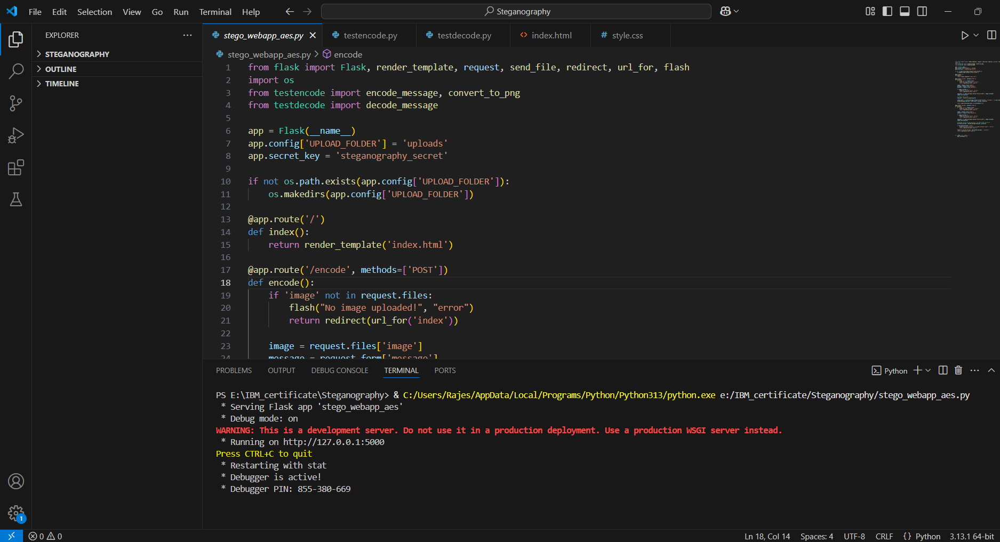

# SECURE DATA HIDING IN IMAGES USING STEGANOGRAPHY

A secure web application built with Flask that enables users to **hide encrypted messages** inside images using **AES encryption** and **steganography**. The tool allows users to encode and decode messages securely through a web interface.  

## 🚀 Features  
✅ Hide messages inside images using AES encryption  
✅ Retrieve hidden messages securely with password authentication  
✅ Web-based interface for ease of use  
✅ Supports PNG, JPG formats for steganography  
✅ Flask-powered backend  

## 🛠️ Technologies Used  
- **Python** (Backend Processing)  
- **Flask** (Web Framework)  
- **PyCryptodome** (AES Encryption)  
- **OpenCV** (Image Processing)  
- **NumPy** (Image Array Manipulation)


🛠️ Installation Steps
1️⃣ Clone the Repository

git clone https://github.com/Rajes-CyberGenjutsu/AES-Steganography-WebApp.git
cd AES-Steganography-WebApp


2️⃣ Install Required Dependencies

pip install -r requirements.txt

3️⃣ Run the Flask Application

python app.py

4️⃣ Open the Web Application

Go to your browser and open:
👉 http://127.0.0.1:5000/


###  Screenshots




### 🛠️ Installation Steps

###🔹 Clone the Repository  
```sh
git clone https://github.com/Rajes-CyberGenjutsu/AES-Steganography-WebApp.git
cd AES-Steganography-WebApp
```


